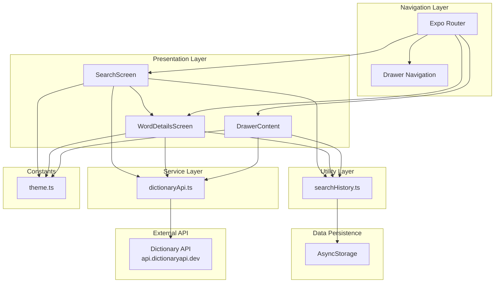
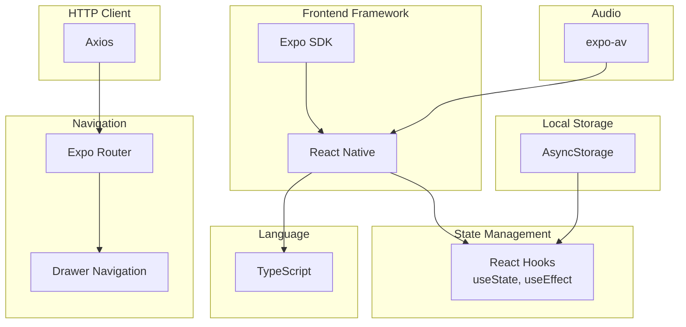

# Mobile Dictionary Application Architecture

## System Architecture Overview

## Layer Responsibilities

### Presentation Layer

- **SearchScreen**: Handles user input for word search, displays search interface
- **WordDetailsScreen**: Displays word definitions, phonetics, audio pronunciation, synonyms
- **DrawerContent**: Manages and displays search history, provides navigation

### Navigation Layer

- **Expo Router**: File-based routing system
- **Drawer Navigation**: Side drawer for search history access

### Service Layer

- **dictionaryApi**: Handles HTTP requests to external dictionary API, error handling, data transformation

### Utility Layer

- **searchHistory**: Manages local storage operations for search history (CRUD operations)

### Constants Layer

- **theme**: Centralized design system (colors, fonts, spacing, shadows, border radius)

### Data Persistence

- **AsyncStorage**: Local storage for search history persistence

### External API

- **Dictionary API**: External REST API for word definitions and related data
