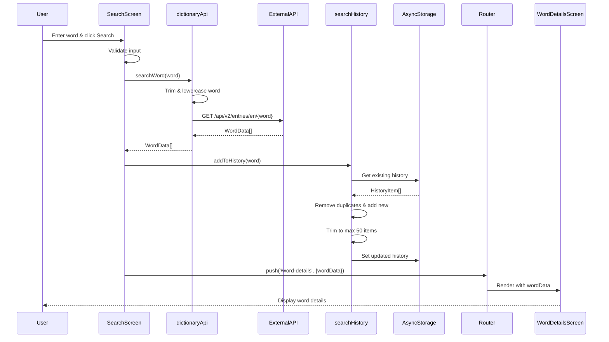
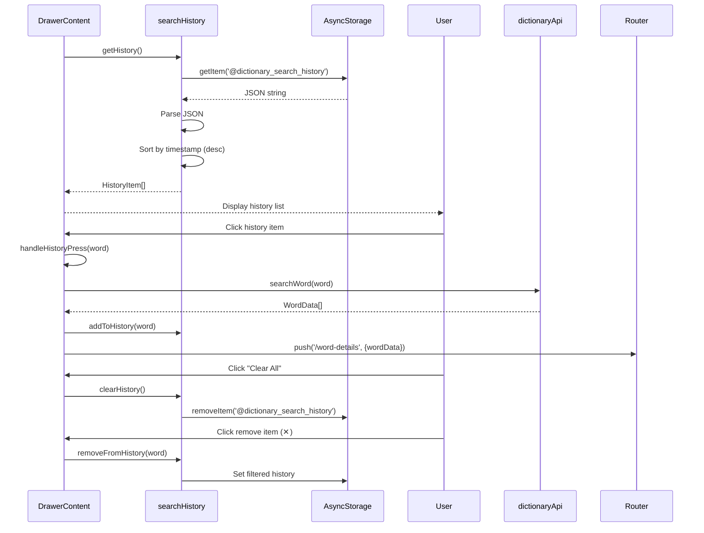
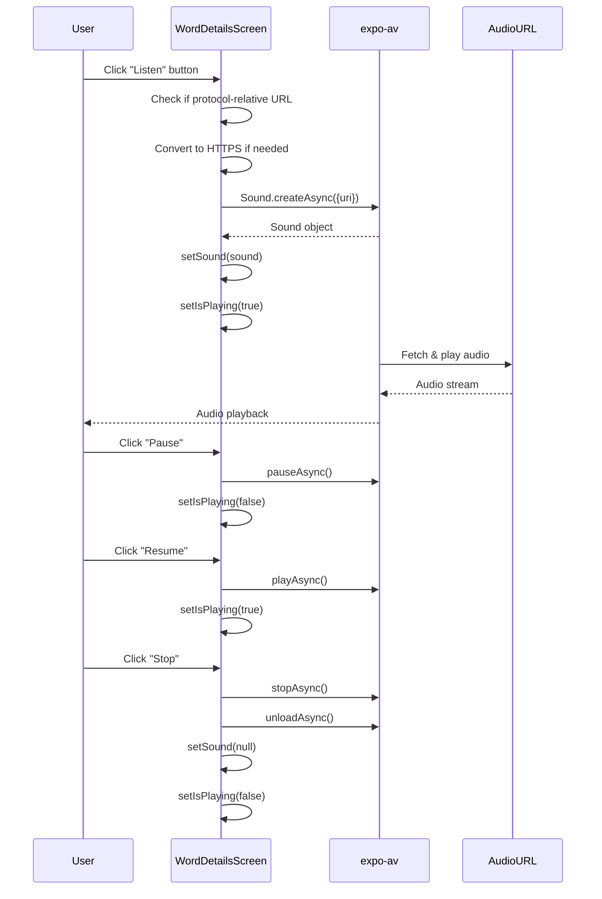
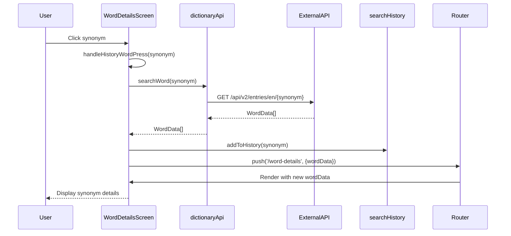
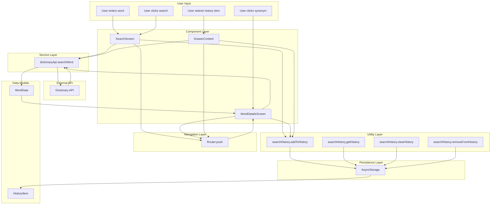
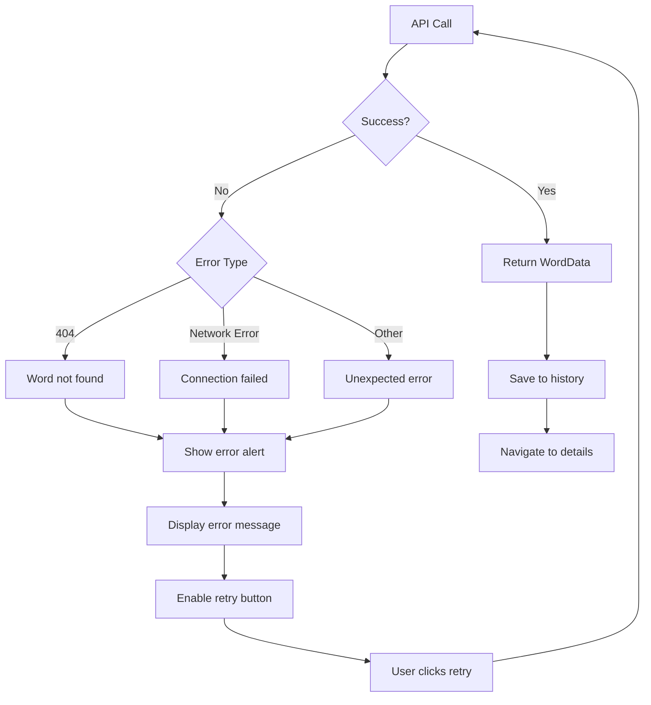
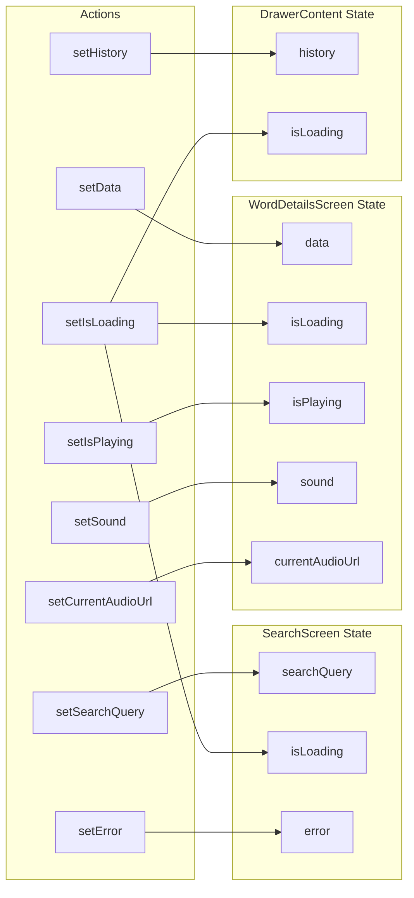

# Mobile Dictionary Data Flow Diagram

## Search Flow



## Search History Flow



## Audio Playback Flow



## Synonym Navigation Flow



## Data Flow Architecture



## Error Handling Flow



## State Management Flow



## Data Persistence Flow

```mermaid
graph TB
    subgraph "Write Operations"
        A[addToHistory]
        B[clearHistory]
        C[removeFromHistory]
    end
    
    subgraph "Read Operations"
        D[getHistory]
    end
    
    subgraph "AsyncStorage"
        E[@dictionary_search_history]
    end
    
    subgraph "Data Format"
        F[JSON string]
        G[HistoryItem array]
    end
    
    A --> E
    B --> E
    C --> E
    D --> E
    
    E --> F
    F --> G
    G --> D
    
    A --> G
    B --> G
    C --> G
```
