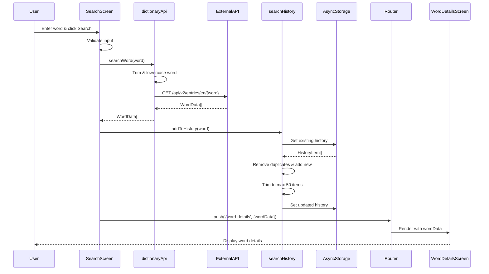
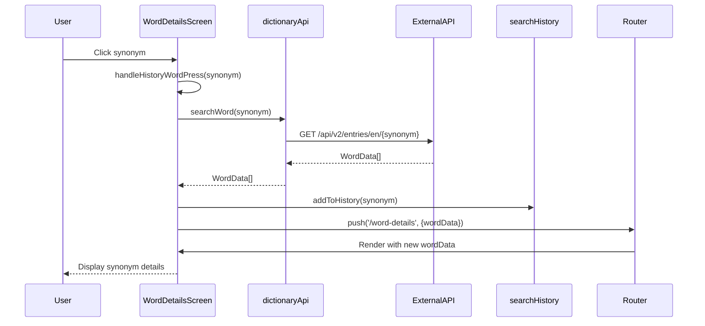
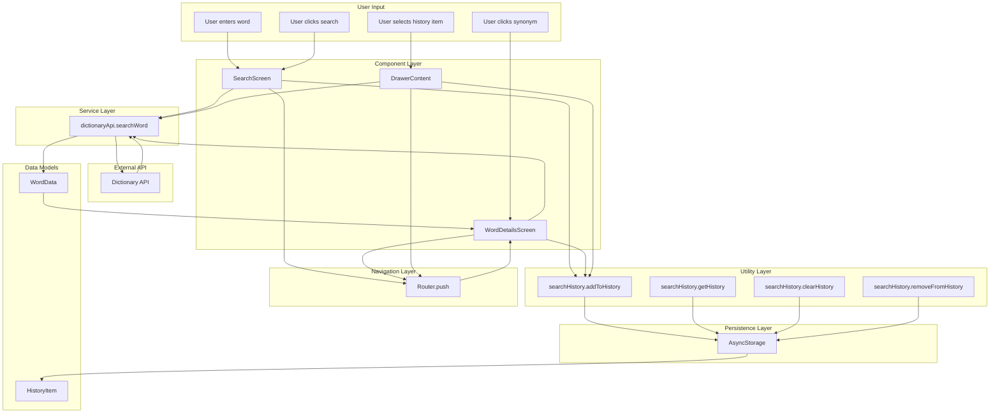

# Mobile Dictionary Data Flow Diagram

## Search Flow

```mermaid
sequenceDiagram
    participant User
    participant SearchScreen
    participant dictionaryApi
    participant ExternalAPI
    participant searchHistory
    participant AsyncStorage
    participant Router
    participant WordDetailsScreen

    User->>SearchScreen: Enter word & click Search
    SearchScreen->>SearchScreen: Validate input
    SearchScreen->>dictionaryApi: searchWord(word)
    dictionaryApi->>dictionaryApi: Trim & lowercase word
    dictionaryApi->>ExternalAPI: GET /api/v2/entries/en/{word}
    ExternalAPI-->>dictionaryApi: WordData[]
    dictionaryApi-->>SearchScreen: WordData[]
    SearchScreen->>searchHistory: addToHistory(word)
    searchHistory->>AsyncStorage: Get existing history
    AsyncStorage-->>searchHistory: HistoryItem[]
    searchHistory->>searchHistory: Remove duplicates & add new
    searchHistory->>searchHistory: Trim to max 50 items
    searchHistory->>AsyncStorage: Set updated history
    SearchScreen->>Router: push('/word-details', {wordData})
    Router->>WordDetailsScreen: Render with wordData
    WordDetailsScreen-->>User: Display word details
```

```mermaid
sequenceDiagram
    participant User
    participant WordDetailsScreen
    participant dictionaryApi
    participant ExternalAPI
    participant searchHistory
    participant Router

    User->>WordDetailsScreen: Click synonym
    WordDetailsScreen->>WordDetailsScreen: handleHistoryWordPress(synonym)
    WordDetailsScreen->>dictionaryApi: searchWord(synonym)
    dictionaryApi->>ExternalAPI: GET /api/v2/entries/en/{synonym}
    ExternalAPI-->>dictionaryApi: WordData[]
    dictionaryApi-->>WordDetailsScreen: WordData[]
    WordDetailsScreen->>searchHistory: addToHistory(synonym)
    WordDetailsScreen->>Router: push('/word-details', {wordData})
    Router->>WordDetailsScreen: Render with new wordData
    WordDetailsScreen-->>User: Display synonym details
```

## Data Flow Architecture

```mermaid
graph TB
    subgraph "User Input"
        A[User enters word]
        B[User clicks search]
        C[User selects history item]
        D[User clicks synonym]
    end

    subgraph "Component Layer"
        E[SearchScreen]
        F[WordDetailsScreen]
        G[DrawerContent]
    end

    subgraph "Service Layer"
        H[dictionaryApi.searchWord]
    end

    subgraph "External API"
        I[Dictionary API]
    end

    subgraph "Utility Layer"
        J[searchHistory.addToHistory]
        K[searchHistory.getHistory]
        L[searchHistory.clearHistory]
        M[searchHistory.removeFromHistory]
    end

    subgraph "Persistence Layer"
        N[AsyncStorage]
    end

    subgraph "Navigation Layer"
        O[Router.push]
    end

    subgraph "Data Models"
        P[WordData]
        Q[HistoryItem]
    end

    A --> E
    B --> E
    C --> G
    D --> F

    E --> H
    G --> H
    F --> H

    H --> I
    I --> H
    H --> P

    E --> J
    F --> J
    G --> J

    J --> N
    K --> N
    L --> N
    M --> N

    N --> Q

    E --> O
    F --> O
    G --> O

    O --> F
    P --> F
```
